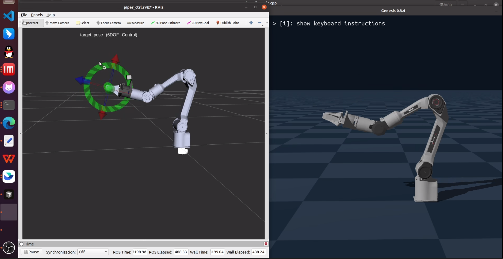

# AgileX Genesis Demos

# deployment

1. setup piper_kinematics

```bash
sudo apt install libeigen3-dev
sudo apt install ros-noetic-eigen-conversions 

git clone https://github.com/vanstrong12138/agilex_genesis_demos.git
cd agilex_genesis_demos
catkin_make
```

2. setup genesis simulator
```bash
# install genesis simulator
conda create -n genesis python=3.10
pip install genesis-world  # Requires Python>=3.10,<3.14;
```

# genesis ros control

```bash
source devel/setup.bash
# this step is only for piper inverse kinematics
roslaunch piper_kinematics piper_ik.launch

# this step is only for visualizing piper in rviz
roslaunch piper_description my_display_urdf_ik.launch

# this step is for start up piper genesis simulation
conda activate genesis
python3 ./scripts/control_piper.py
```

# 3. Control Piper in using rviz visualized marker

